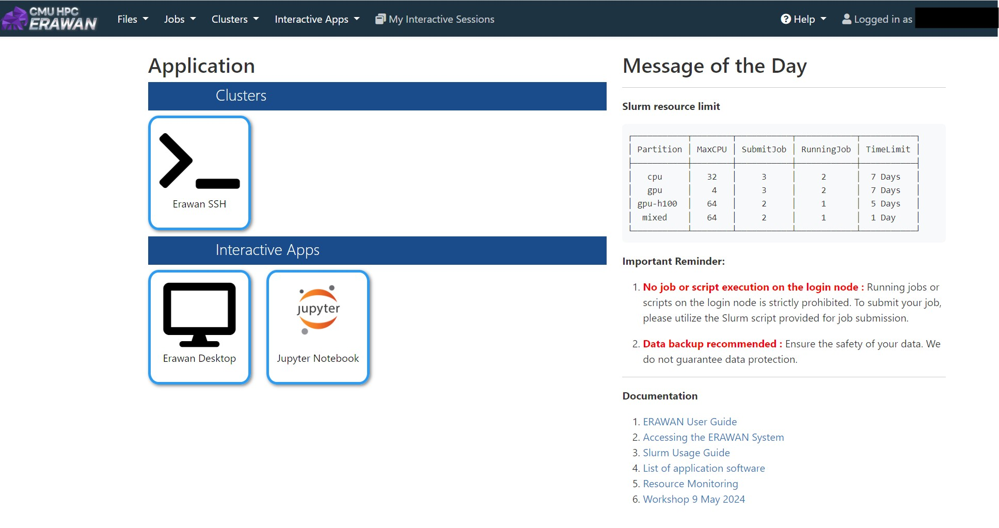

# Ondemand Workshop

Open OnDemand (OOD) คือเป็นเว็บไซต์ที่ช่วยให้ผู้ใช้งานสามารถเข้าถึงและใช้งานระบบคอมพิวเตอร์สมรรถนะสูง (HPC) ได้ผ่านเว็บเบราว์เซอร์ โดยไม่ต้องใช้คำสั่งผ่านเทอร์มินัลโดยตรง ซึ่งสามารเข้าใช้งานผ่าน https://erawan.cmu.ac.th

---
## 📂 1. การใช้งาน Jupyter

### 1 ML (Machine Learning)
ผู้ใช้สามารถเปิด Jupyter Notebook เพื่อทดลองและพัฒนาโมเดล Machine Learning บน HPC ได้อย่างสะดวก รองรับไลบรารีเช่น TensorFlow, PyTorch และ Scikit-learn

### 2 RAG Chatbot
สามารถใช้งาน Jupyter ในการสร้างและทดลอง RAG (Retrieval-Augmented Generation) Chatbot โดยเชื่อมต่อกับฐานข้อมูลหรือเอกสาร เพื่อสร้างระบบถาม-ตอบอัจฉริยะ

### 3 LLM text-to-image
รองรับการใช้งานโมเดล LLM สำหรับงาน text-to-image เช่น Stable Diffusion หรือ DALL-E ผ่าน Jupyter Notebook เพื่อสร้างภาพจากข้อความ

---
## 📂 2. การใช้งาน Erawan Desktop

### 1 Paraview
ผู้ใช้สามารถเปิด Paraview ผ่าน Erawan Desktop เพื่อวิเคราะห์และแสดงผลข้อมูลเชิงวิทยาศาสตร์แบบ 3D Visualization

### 2 RStudio
รองรับการใช้งาน RStudio สำหรับการวิเคราะห์ข้อมูลและสร้างกราฟสถิติผ่าน Desktop 